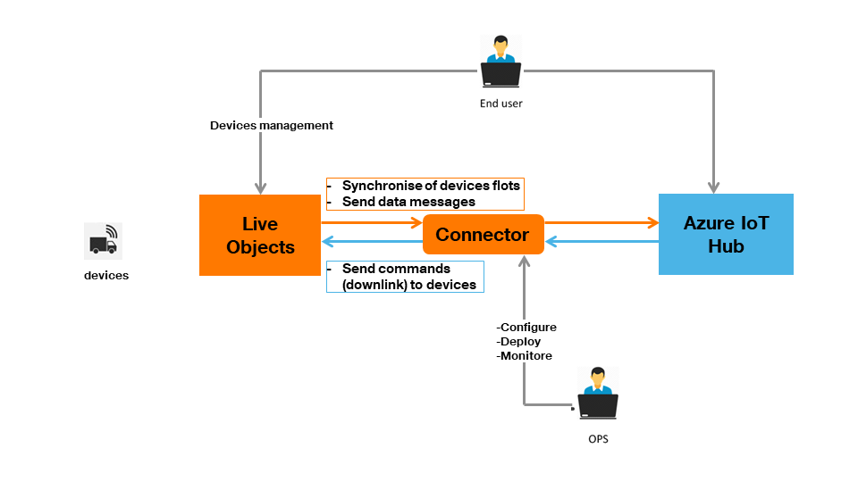
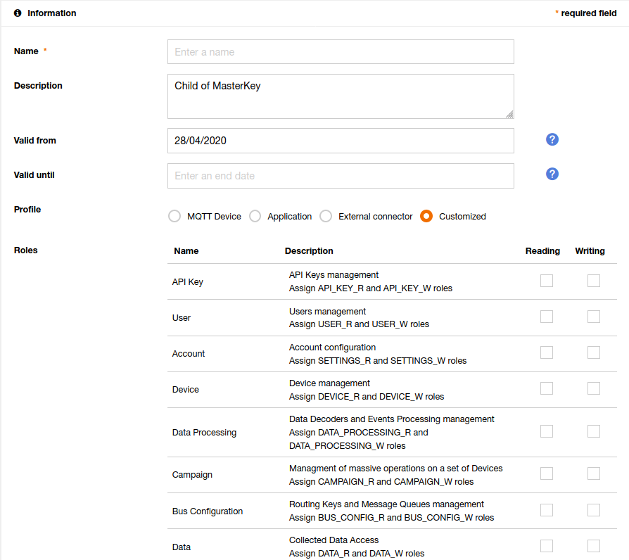
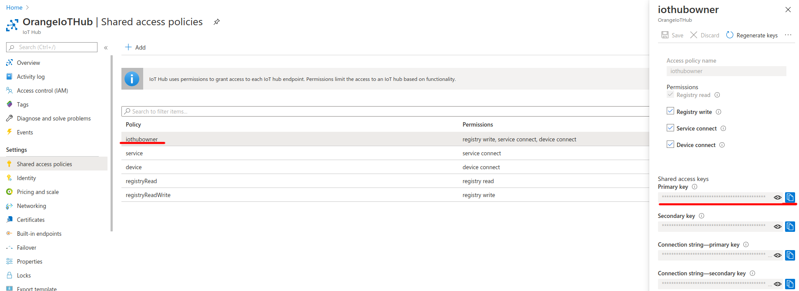

## Table of contents
* [General info](#general-info)
* [Technologies](#technologies)
* [Requirements](#requirements)
* [Configuration](#configuration)
    * [Logging](#logging)
    * [Azure Webapp Maven Plugin](#azure-webapp-maven-plugin)
    * [Connector](#connector)
* [Installation](#installation)

## General info


This repository contains everything you need to create 'Live Objects to Azure IoT Hub' connector. This project is intended for Live Objects users wishing to explore integration patterns with Azure and for organizations already running business logic on Azure planning to work on events from IoT devices sourced via Live Objects.

Three main features are:
* **devices synchronization** - every device registered in Live Objects will appear  in IoT Hub and every device deleted from Live Objects will be also deleted from IoT Hub 
* **messages synchronization** - every message which will be send from device to Live Objects will appear in IoT Hub
* **commands synchronization** - every command from IoT Hub will be sent to the devices via Live Objects API

One connector can handle one customer (one IoT Hub). If you have more than one you need to setup one instance of connector per each IoT Hub. 

It can be only one instance of connector per IoT Hub. Two or more instances connected to the same IoT Hub will cause problems.

The software is an open source toolbox which has to be integrated into an end to end solution. The ordering of messages is not guaranteed to be preserved; the application uses thread pools to run its MQTT and IoT Hub adapters which may cause some messages to arrive in IoT Hub out of order in which they were kept within Live Objects’ MQTT queue.
Live Objects platform supports load balancing between multiple MQTT subscribers.

## Technologies
* Java 8
* Spring Boot 2.1.8.RELEASE
* Microsoft Azure SDK IoT 1.22.0
* Guava 28.1-jre
* Microsoft Azure SDK For Event Hubs 2.3.2
* Microsoft Application Insights Java SDK Spring Boot Starter 2.5.1
* Azure Metrics Spring Boot Starter 2.2.1

## Requirements
In order to run the connector you need to have: 
* **Live Objects account with MQTT fifo queue API key** which can access the queue (API key generation is described in the [user guide](https://liveobjects.orange-business.com/cms/app/uploads/EN_User-guide-Live-Objects-4.pdf#%5B%7B%22num%22%3A190%2C%22gen%22%3A0%7D%2C%7B%22name%22%3A%22XYZ%22%7D%2C68%2C574%2C0%5D)), 
* **Azure account with an IoT Hub created** (creation process is described in official [documentation](https://docs.microsoft.com/en-us/azure/iot-hub/iot-hub-create-through-portal). 
* **Azure CLI installed** (installation process is described in official [documentation](https://docs.microsoft.com/en-us/cli/azure/install-azure-cli?view=azure-cli-latest)),  
* **Application Insights resource created** (creation process is described in official [documentation](https://docs.microsoft.com/pl-pl/azure/azure-monitor/app/create-new-resource)). 
* **App Service plan created** (creation process is described in official [documentation](https://docs.microsoft.com/en-us/azure/app-service/app-service-plan-manage)). 
* **Java SE Development Kit 8 installed**
* **Apache Maven installed**

## Configuration

#### Logging
Logging configuration can be found in **logback.xml** file located in src/main/resources. You can find more information about how to configure your logs [here](http://logback.qos.ch/manual/configuration.html)

#### Azure Webapp Maven Plugin
Deployment to Azure is performed by the Azure Webapp Maven Plugin. Its configuration is included in `pom.xml` file within the connector project.
The following lines are relevant:
```
<resourceGroup>YourResourceGroupName</resourceGroup>
<appServicePlanName>YourAppServicePlanName</appServicePlanName>
<appName>lo2iothub</appName>
```
The `resourceGroup` and `appServicePlanName` should correspond to values provided during App Service Plan creation. These values can be found in the details of the App Service Plan:  

 

Application name will be used to uniquely identify the deployed connector app.


#### Connector
All configuration can be found in **application.yaml** file located in src/main/resources
```
1    lo:
2      api-key: YOUR_API_KEY
3      device-url: https://liveobjects.orange-business.com/api/v1/deviceMgt/devices
4      
5      uri: ssl://liveobjects.orange-business.com:8883
6      username: YOUR_USERNAME
7    
8      topics: 
9        - fifo/MESSAGES_TOPIC
10       - fifo/DEVICES_TOPIC
11    
12     clientId: mqtt2iot
13     recovery-interval: 10000
14     completion-timeout: 20000
15     connection-timeout: 30000
16     qos: 1
17     keep-alive-interval-seconds: 0
18     page-size: 20
19      
20   azure:
21     iot-connection-string: YOUR_IOT_CONNECTION_STRING
22     iot-host-name: YOUR_IOT_HOST_NAME
23     synchronization-device-interval: 1000000
24     synchronization-thread-pool-size: 40
25     messaging-thread-pool-size: 40
26     device-client-connection-timeout: 5000
27     tagPlatformKey: platform
28     tagPlatformValue: LiveObjects
29     application-insights:
30       instrumentation-key: YOUR_INSTMENTATION_KEY
31       channel:
32         in-process:
33           developer-mode: true
34           max-telemetry-buffer-capacity: 500
35           flush-interval-in-seconds: 5
36   spring:
37     application:
38       name: Lo2IotHub
```
You can change all values but the most important are:  

*2* - Live Objects API key with at least DEVICE_R and DEVICE_W roles  
*3* - Devices endpoint url from Live Objects REST API  
*5* - Live Objects mqtt url  
*6* - Live Objects mqtt username    
*9* - Name of the MQTT queue for the device messages   
*10* - Name of the MQTT queue for the device created events   
*16* - Message QoS  
*18* - Devices page size   
*21* - Connection string with host name, shared access key name and shared access key. The connection string should look like this: HostName=your_host_name;SharedAccessKeyName=your_key_name;SharedAccessKey=your_key   
*22* - IoT Hub host name  
*25* - How many threads will be used in message synchronization process  
*30* - Application insights instrumentation key   

##### Generate Live Objects API key
Login to Live Objects Web Portal an go to **Administration** -> **API keys** 

 

Click **Add** button and fill fields. 



To  validate  the  creation  of  the  key,  click  on  the  **Create**  button.  Your  key  is  generated  in  the form of an alphanumeric sequence and aQR code.

The api key generated in this way should be placed in the connector configuration file:

```
api-key: 1a2b345c6de7891fg12h
```

#### IoT connection string
The `iot-connection-string` value should contain IoT Hub host name, shared access key name and shared access key. How to find the IoT Hub host name is described in the [IoT Hub host name section](#iot-hub-hostname). Shared access key name and shared access key can be found in the Shared access policies tab:



The `iot-connection-string` should be placed in the connector configuration file and should look like this: 

```
iot-connection-string: HostName=OrangeIoTHub.azure-devices.net;SharedAccessKeyName=iothubowner;SharedAccessKey=aBCd0E123FgIJK456lm=
```

#### IoT Hub hostname
The `iot-host-name` can be found in the details of IoT Hub:


The hostname value from IoT Hub should be placed in the connector configuration file:

```
iot-host-name: OrangeIoTHub.azure-devices.net
```

#### Instrumentation key
The `instrumentation-key` can be found in the details of Application Insights:


The `instrumentation-key` should be placed in the connector configuration file: 

```
instrumentation-key: abcdef-abcd-1abcd-abcd-abcdefghijk
```


### Installation

In order to be deployed to Azure, the project uses Azure Webapp Maven Plugin. The installation description is based on the following [documentation](https://docs.microsoft.com/en-us/java/azure/spring-framework/deploy-spring-boot-java-app-with-maven-plugin).

#### Azure login

In order to deploy the application, the prerequisite is to have a logged session to Azure. Run the following command using Azure CLI tool:
```
az login
```
Follow the instructions to complete the login process. 

#### Build and deployment of the connector

Build the JAR file using command:
```
mvn clean package
```
Deploy the application with the command:
```
mvn azure-webapp:deploy
```

If you repeat those steps, application will be redeployed, replacing the previously-deployed instance on Azure. Please keep in mind that you don’t have to repeat the login to Azure (unless the session expired, which will result in appropriate error message during app deployment).

