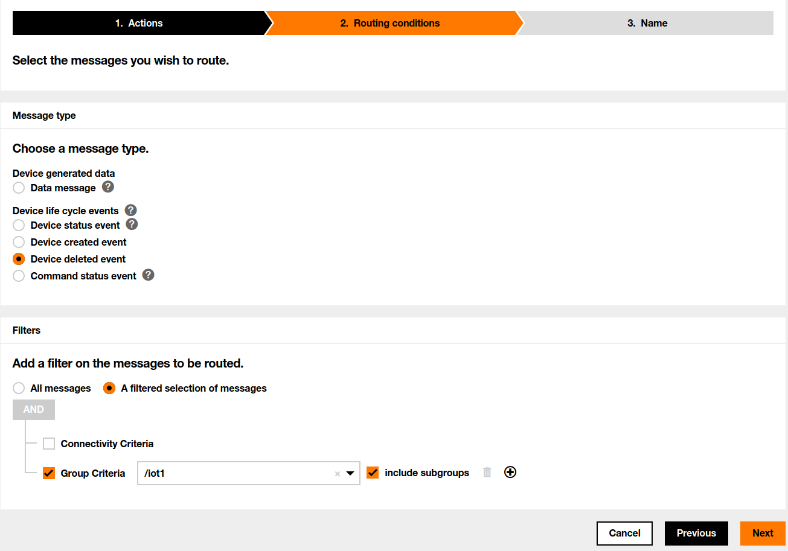

## Table of contents
* [General info](#general-info)
* [Technologies](#technologies)
* [Requirements](#requirements)
* [Getting the installation package](#getting-the-installation-package)
* [Installation](#installation)
* [Configuration](#configuration)
  * [Connector](#connector)
  * [Logging](#logging)
* [Launching](#launching)
* [Deploy on Azure Linux virtual machine](#deploy-on-azure-linux-virtual-machine)

## General info


This repository contains everything you need to create 'Live Objects to Azure IoT Hub' connector. This project is intended for Live Objects users wishing to explore integration patterns with Azure and for organizations already running business logic on Azure planning to work on events from IoT devices sourced via Live Objects.

Three main features are:
* **devices synchronization** - every device registered in Live Objects will appear  in IoT Hub and every device deleted from Live Objects will be also deleted from IoT Hub 
* **messages synchronization** - every message which will be send from device to Live Objects will appear in IoT Hub
* **commands synchronization** - every command from IoT Hub will be sent to the devices via Live Objects API

One connector can handle many Live Objects accounts and Iot Hubs. 

It can be only one instance of connector per Live Objects account. Two or more instances connected to the same Live Objects account will cause problems.

The software is an open source toolbox which has to be integrated into an end to end solution. The ordering of messages is not guaranteed to be preserved; the application uses thread pools to run its MQTT and IoT Hub adapters which may cause some messages to arrive in IoT Hub out of order in which they were kept within Live Objects’ MQTT queue.
Live Objects platform supports load balancing between multiple MQTT subscribers.

## Technologies
* Java 8
* Spring Boot 2.4.4
* Microsoft Azure SDK IoT 1.22.0
* Microsoft Application Insights Java SDK Spring Boot Starter 2.5.1
* Azure Metrics Spring Boot Starter 2.2.1

## Requirements
In order to run the connector you need to have: 
* **Live Objects account** 
* **Azure account with an IoT Hub created (one or many)** (creation process is described in official [documentation](https://docs.microsoft.com/en-us/azure/iot-hub/iot-hub-create-through-portal) 
* **Azure CLI installed** (installation process is described in official [documentation](https://docs.microsoft.com/en-us/cli/azure/install-azure-cli?view=azure-cli-latest))
* **Application Insights resource created (per each Iot Hub)** (creation process is described in official [documentation](https://docs.microsoft.com/pl-pl/azure/azure-monitor/app/create-new-resource)) 
* **App Service plan created (per each Iot Hub)** (creation process is described in official [documentation](https://docs.microsoft.com/en-us/azure/app-service/app-service-plan-manage))
* **Development tools (only when building the package)**
 * **Java SE Development Kit 8**
 * **Apache Maven**

## Getting the installation package

The installation package can be acquired in one of two ways:

### Release

It can be downloaded from https://github.com/DatavenueLiveObjects/Azure-IoT-Hub-connector-to-install-on-Azure/releases

### Building
```
mvn clean package -Prelease
```
After running this command, the file  `lo2iot-[VERSION].zip` will be created in the target directory. This file should be placed where the connector will be started, and then unpacked. 

## Installation

The file downloaded/created above should be placed where the connector will be started, and then unpacked. You can deploy this connector wherever you want (local server, cloud provider etc.).

After unpacking the archive, you should get a structure similar to this:
```
bin/
conf/
data/
lib/
```

## Configuration

### Connector
All configuration can be found in **application.yaml** file located in src/main/resources

```
1    tenant-list:
2      - 
3        live-objects-properties:
4          hostname: liveobjects.orange-business.com
5          api-key: YOUR_API_KEY
6          username: application
7          connection-timeout: 30000
8          qos: 1
9          keep-alive-interval-seconds: 30
10         page-size: 20
11         synchronization-device-interval: 10
12         mqtt-persistence-dir: ${basedir:.}/temp/
13  
14       azure-iot-hub-list:
15         -
16           iot-connection-string: YOUR_IOT_CONNECTION_STRING
17           iot-host-name: YOUR_IOT_HOST_NAME
18           synchronization-thread-pool-size: 40
19           device-client-connection-timeout: 5000
20           tagPlatformKey: platform
21           tagPlatformValue: LiveObjectsGroupIoT1
22    
23           lo-messages-topic: MESSAGES_TOPIC
24           lo-devices-topic: DEVICES_TOPIC
25           lo-devices-group: DEVICES_GROUP
26
27         -
28           iot-connection-string: YOUR_IOT_CONNECTION_STRING
29           iot-host-name: YOUR_IOT_HOST_NAME
30           synchronization-thread-pool-size: 40
31           device-client-connection-timeout: 5000
32           tagPlatformKey: platform
33           tagPlatformValue: LiveObjectsGroupIoT1
34    
35           lo-messages-topic: MESSAGES_TOPIC
36           lo-devices-topic: DEVICES_TOPIC
37           lo-devices-group: DEVICES_GROUP
38
39   azure:
40     application-insights:
41       instrumentation-key: YOUR_INSTMENTATION_KEY
42       channel:
43         in-process:
44           developer-mode: true
45           max-telemetry-buffer-capacity: 500
46           flush-interval-in-seconds: 5
47
48   management:
49     endpoints:
50       web:
51         exposure:
52           include: "*"
53
54   spring:
55     application:
56       name: Lo2IotHub
```

#### hostname
Live Objects hostname

#### api-key
Live Objects API key with at least DEVICE_R, DEVICE_W and BUS_R roles

Login to Live Objects Web Portal an go to **Administration** -> **API keys**


Click **Add** button and fill fields.


To  validate  the  creation  of  the  key,  click  on  the  **Create**  button.  Your  key  is  generated  in  the form of an alphanumeric sequence and aQR code.

#### username
Live Objects mqtt username (should be set to **application**)

#### connection-timeout
This value, measured in seconds, defines the maximum time interval the client will wait for the network connection to the MQTT server to be established

#### qos
Message QoS

#### keep-alive-interval-seconds
This value, measured in seconds, defines the maximum time interval between messages sent or received. It enables the client to detect if the server is no longer available, without having to wait for the TCP/IP timeout. The client will ensure that at least one message travels across the network within each keep alive period.  In the absence of a data-related message during the time period, the client sends a very small "ping" message, which the server will acknowledge. A value of 0 disables keepalive processing in the client.

#### page-size
Maximum number of devices in single response. Max 1000

#### synchronization-device-interval
Controls the interval (in seconds) at which device synchronization process starts.

#### iot-connection-string
This parameter value should contain IoT Hub host name, shared access key name and shared access key. It can be found in the Shared access policies tab:


#### iot-host-name
The `iot-host-name` can be found in the details of IoT Hub:


#### synchronization-thread-pool-size 
How many threads will be used in devices synchronization process

#### device-client-connection-timeout
The length of time, in milliseconds, that any given operation will expire in. These operations include reconnecting upon a connection drop and sending a message.

#### tagPlatformKey
All devices created in IoT Hub have a tag with given name

#### tagPlatformValue
All devices created in IoT Hub have a tag with given value

#### lo-devices-group
Name of device group in Live Objects
To create group you need to login to Orange Web Portal an go to **Devices**


Click **Create a group of device** in the left menu, named it and confirm


#### lo-messages-topic
Name of the FIFO queue for messages from devices belong to *lo-devices-group*.
To create such queue you need to login to Orange Web Portal an go to **Data -> FIFO** 


Click **Add** button and fill fields


And click **Register** button

Later you need to create routing. Go to **Data -> Routing** and click **Add a routing rule**


Choose **Forward to your servers in MQTTs, through FIFO queues** by clicking **+ FIFO** button and select your fifo for storing messages. Click **Next** button


Choose a message type of **Data message**, in **Filters** section select **A filtered selection of messages**, select **Group Criteria** and choose your device group. Click **Next** button


Give a routing name and click **Complete** button


#### lo-devices-topic
Name of the FIFO queue for the device created and deleted events   
To create such queue you need to login to Orange Web Portal an go to **Data -> FIFO** 


Click **Add** button and fill fields


And click **Register** button

Later you need to create routing. Go to **Data -> Routing** and click **Add a routing rule**


Choose **Forward to your servers in MQTTs, through FIFO queues** by clicking **+ FIFO** button and select your fifo for storing devices events. Click **Next** button


Choose a message type of **Device created event**, in **Filters** section select **A filtered selection of messages**, select **Group Criteria** and choose your device group. Click **Next** button


Give a routing name and click **Complete** button


Repeat last step and create new routing for **Device deleted event** (choose the same fifo as for Device created event)



#### instrumentation-key
The value of this parameter can be found in the details of Application Insights:


### Logging
Logging configuration can be found in **logback.xml** file located in src/main/resources. You can find more information about how to configure your logs [here](http://logback.qos.ch/manual/configuration.html)

## Launching
In order to run the connector, use the `app.sh` file for linux or `app.bat` if you are using windows. These files are located in the `bin/` directory.

## Deploy on Azure Linux virtual machine
You can deploy this connector wherever you want (local server, cloud provider etc.). As an example we provide instruction how to deploy this connector on Azure Virtual Machine. You can do this by following these steps:

- Install Azure CLI (installation process is described in official [documentation](https://docs.microsoft.com/en-us/cli/azure/install-azure-cli?view=azure-cli-latest)) and log in with the command:
  ```
  az login
  ```
- Create a [resource group](https://docs.microsoft.com/en-us/cli/azure/group?view=azure-cli-latest#az_group_create) and a [virtual machine](https://docs.microsoft.com/en-us/cli/azure/vm?view=azure-cli-latest#az_vm_create). Examples of command usage:
  ```
  az group create --name IoT-Hub-connector --location westeurope
  ```
  ```
  az vm create -n IoT-Hub-connector -g IoT-Hub-connector --image UbuntuLTS --admin-username azureuser
  ```
- Provide correct parameters in `application.yaml` and create an installation package with the command:
  ```
  mvn clean package -Prelease
  ```
- Copy the file to the virtual machine ([documentation](https://docs.microsoft.com/pl-pl/azure/virtual-machines/linux/copy-files-to-linux-vm-using-scp)):
  ```
  scp target/lo2iot-1.0.zip azureuser@YOUR_MACHINE_IP:~
  ```
- Install unzip and java  
  ```
  sudo apt-get install unzip
  ```
  ```
  sudo apt-get install openjdk-11-jdk -y
  ```
- Unpack the installation package:
  ```
  unzip lo2iot-1.0.zip 
  ```
- Run `start.sh` script:
  ```
  ./lo2iot-1.0/bin/app.sh
  ```

If you want to stop and completely delete this machine you should run:
```
az group delete -n IoT-Hub-connector
```
