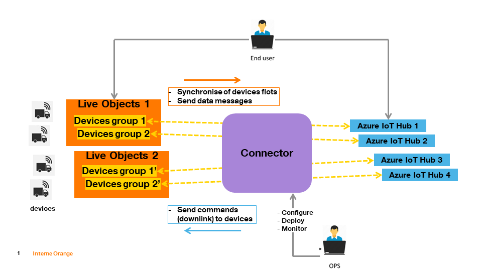

## Table of contents
* [General info](#general-info)
* [Technologies](#technologies)
* [Requirements](#requirements)
* [Configuration](#configuration)
    * [Logging](#logging)
    * [Azure Webapp Maven Plugin](#azure-webapp-maven-plugin)
    * [Connector](#connector)
* [Installation](#installation)

## General info


This repository contains everything you need to create 'Live Objects to Azure IoT Hub' connector. This project is intended for Live Objects users wishing to explore integration patterns with Azure and for organizations already running business logic on Azure planning to work on events from IoT devices sourced via Live Objects.

Three main features are:
* **devices synchronization** - every device registered in Live Objects will appear  in IoT Hub and every device deleted from Live Objects will be also deleted from IoT Hub 
* **messages synchronization** - every message which will be send from device to Live Objects will appear in IoT Hub
* **commands synchronization** - every command from IoT Hub will be sent to the devices via Live Objects API

One connector can handle many Iot Hubs. 

It can be only one instance of connector per Live Objects account. Two or more instances connected to the same Live Objects account will cause problems.

The software is an open source toolbox which has to be integrated into an end to end solution. The ordering of messages is not guaranteed to be preserved; the application uses thread pools to run its MQTT and IoT Hub adapters which may cause some messages to arrive in IoT Hub out of order in which they were kept within Live Objects’ MQTT queue.
Live Objects platform supports load balancing between multiple MQTT subscribers.

## Technologies
* Java 8
* Spring Boot 2.1.8.RELEASE
* Microsoft Azure SDK IoT 1.22.0
* Guava 28.1-jre
* Microsoft Application Insights Java SDK Spring Boot Starter 2.5.1
* Azure Metrics Spring Boot Starter 2.2.1

## Requirements
In order to run the connector you need to have: 
* **Live Objects account** 
* **Azure account with an IoT Hub created (one or many)** (creation process is described in official [documentation](https://docs.microsoft.com/en-us/azure/iot-hub/iot-hub-create-through-portal) 
* **Azure CLI installed** (installation process is described in official [documentation](https://docs.microsoft.com/en-us/cli/azure/install-azure-cli?view=azure-cli-latest))
* **Application Insights resource created (per each Iot Hub)** (creation process is described in official [documentation](https://docs.microsoft.com/pl-pl/azure/azure-monitor/app/create-new-resource)) 
* **App Service plan created (per each Iot Hub)** (creation process is described in official [documentation](https://docs.microsoft.com/en-us/azure/app-service/app-service-plan-manage))
* **Java SE Development Kit 8 installed**
* **Apache Maven installed**

## Configuration

### Connector
All configuration can be found in **application.yaml** file located in src/main/resources

```
1    lo:
2      api-key: YOUR_API_KEY
3      api-url: https://liveobjects.orange-business.com/api
4      
5      uri: ssl://liveobjects.orange-business.com:8883
6      username: application
7    
8      clientId: mqtt2iot
9      recovery-interval: 10000
10     completion-timeout: 30000
11     connection-timeout: 30
12     keep-alive-interval-seconds: 0
13     qos: 1
14     page-size: 20
15     
16     synchronization-device-interval: 60000
17 
18   azure-iot-hub-list:
19     -
20       iot-connection-string: YOUR_IOT_CONNECTION_STRING
21       iot-host-name: YOUR_IOT_HOST_NAME
22       synchronization-thread-pool-size: 10
23       device-client-connection-timeout: 5000
24       tagPlatformKey: platform
25       tagPlatformValue: LiveObjectsGroup1
26    
27       lo-devices-group: DEVICES_GROUP
28       lo-messages-topic: MESSAGES_TOPIC
29       lo-devices-topic: DEVICES_TOPIC
31
32       (...)
33          
34   azure:
35     application-insights:
36       instrumentation-key: YOUR_INSTMENTATION_KEY
37
38   management:
39     endpoints:
40       web:
41         exposure:
42           include: "*"
43
44   spring:
45     application:
46       name: Lo2IotHub

```

#### api-key
Live Objects API key with at least DEVICE_R and BUS_R roles

Login to Live Objects Web Portal an go to **Administration** -> **API keys** 

 

Click **Add** button and fill fields. 


To  validate  the  creation  of  the  key,  click  on  the  **Create**  button.  Your  key  is  generated  in  the form of an alphanumeric sequence and aQR code.

#### api-url
REST API endpoint url, leave the value of https://liveobjects.orange-business.com/api

#### uri
Live Objects mqtt url, leave the value of ssl://liveobjects.orange-business.com:8883

#### username
Live Objects mqtt username (should be set to **application**)

#### clientId
Unique identifier for client connected to the broker. Can be freely changed

#### recovery-interval
Controls the interval (in miliseconds) at which the mqtt client attempts to reconnect after a failure. It defaults to 10000ms (10 seconds)

#### completion-timeout
Set the completion timeout for mqtt operations in miliseconds

#### connection-timeout
This value, measured in seconds, defines the maximum time interval the client will wait for the network connection to the MQTT server to be established

#### keep-alive-interval-seconds
This value, measured in seconds, defines the maximum time interval between messages sent or received. It enables the client to detect if the server is no longer available, without having to wait for the TCP/IP timeout. The client will ensure that at least one message travels across the network within each keep alive period.  In the absence of a data-related message during the time period, the client sends a very small "ping" message, which the server will acknowledge. A value of 0 disables keepalive processing in the client.

#### qos
Message QoS 

#### page-size
Maximum number of devices in single response. Max 1000

#### synchronization-device-interval
Controls the interval (in miliseconds) at which device synchronization process starts.

#### iot-connection-string
This parameter value should contain IoT Hub host name, shared access key name and shared access key. It can be found in the Shared access policies tab:


#### iot-host-name
The `iot-host-name` can be found in the details of IoT Hub:


#### synchronization-thread-pool-size 
How many threads will be used in devices synchronization process

#### device-client-connection-timeout
The length of time, in milliseconds, that any given operation will expire in. These operations include reconnecting upon a connection drop and sending a message.

#### tagPlatformKey
All devices created in IoT Hub have a tag with given name

#### tagPlatformValue
All devices created in IoT Hub have a tag with given value

#### lo-devices-group
Name of device group in Live Objects
To create group you need to login to Orange Web Portal an go to **Devices**

Click **Create a group of device** in the left menu, named it and confirm


#### lo-messages-topic
Name of the FIFO queue for messages from devices belong to *lo-devices-group*
To create such queue you need to login to Orange Web Portal an go to **Data -> FIFO** 

Click **Add** button and fill fields

And click **Register** button

Later you need to create routing. Go to **Data -> Routing**

Click **Add a routing rule** and give a routing name and click **Next** button

Choose a message type of "Data message", in **Filters** section select **A filtered selection of messages **, select **Group Criteria** and choose your device group. Click **Next** button

Choose **Forward to one or more FIFOs** by clicking **+ FIFO** button and select your fifo for storing messages. Click **Complete** button


#### lo-devices-topic
Name of the FIFO queue for the device created and deleted events   
To create such queue you need to login to Orange Web Portal an go to **Data -> FIFO** 

Click **Add** button and fill fields

And click **Register** button

Later you need to create routing. Go to **Data -> Routing**

Click **Add a routing rule** and give a routing name and click **Next** button

Choose a message type of **Device created event**, in **Filters** section select **A filtered selection of messages **, select **Group Criteria** and choose your device group. Click **Next** button

Choose **Forward to one or more FIFOs** by clicking **+ FIFO** button and select your fifo for storing devices events. Click **Complete** button


Repeat last step and create new routing for **Device deleted event ** (choose the same fifo as for Device created event) 

#### instrumentation-key
The value of this parameter can be found in the details of Application Insights:


### Logging
Logging configuration can be found in **logback.xml** file located in src/main/resources. You can find more information about how to configure your logs [here](http://logback.qos.ch/manual/configuration.html)

### Azure Webapp Maven Plugin
Deployment to Azure is performed by the Azure Webapp Maven Plugin. Its configuration is included in `pom.xml` file within the connector project.
The following lines are relevant:

```
<resourceGroup>YourResourceGroupName</resourceGroup>
<appServicePlanName>YourAppServicePlanName</appServicePlanName>
<appName>lo2iothub</appName>
```

The `resourceGroup` and `appServicePlanName` should correspond to values provided during App Service Plan creation. These values can be found in the details of the App Service Plan:  

 

Application name will be used to uniquely identify the deployed connector app.

### Installation

In order to be deployed to Azure, the project uses Azure Webapp Maven Plugin. The installation description is based on the following [documentation](https://docs.microsoft.com/en-us/java/azure/spring-framework/deploy-spring-boot-java-app-with-maven-plugin).

#### Azure login

In order to deploy the application, the prerequisite is to have a logged session to Azure. Run the following command using Azure CLI tool:
```
az login
```
Follow the instructions to complete the login process. 

#### Build and deployment of the connector

Build the JAR file using command:
```
mvn clean package
```
Deploy the application with the command:
```
mvn azure-webapp:deploy
```

If you repeat those steps, application will be redeployed, replacing the previously-deployed instance on Azure. Please keep in mind that you don’t have to repeat the login to Azure (unless the session expired, which will result in appropriate error message during app deployment).